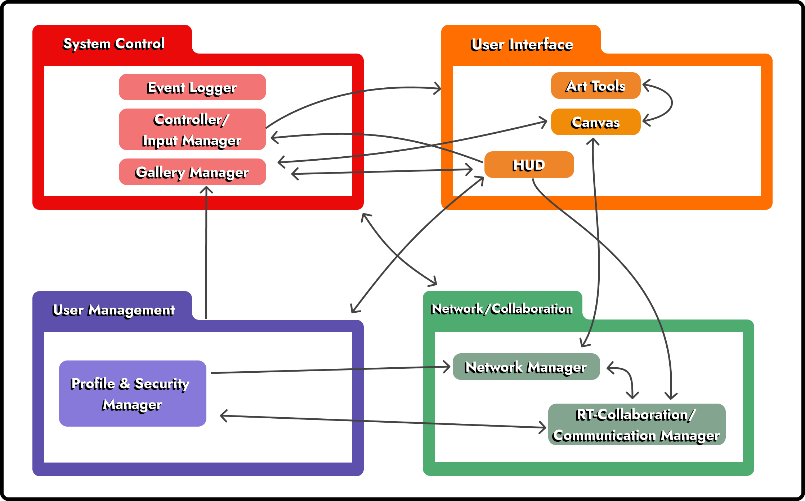

# VR Art Gallery — Project X

> A multiplayer Virtual Reality art creation and exhibition platform built in Unity.  
> Artists can paint in 3D space, collaborate in real time, submit works to galleries, and visit exhibitions from anywhere.

---

## Gallery Preview

<!--  -->

---

## Architecture Overview



The system is structured across three principal layers: a **Unity VR Client** running on Meta Horizon OS or Windows PC, a **Backend Services** layer (Supabase, Netcode for GameObjects), and a **Cloud/Storage** layer for persisted artwork and user data.

---

## Technology Stack

| Layer | Technology | Role |
|---|---|---|
| **VR Engine** |  | Game engine and scene management |
| **Language** |  | All runtime scripts |
| **VR SDKs** |   | Hardware abstraction, hand/controller tracking |
| **Database** |  | User profiles, artwork records, ACL entries |
| **Auth** |  | Sign-up, sign-in, session management |
| **Storage** |  | Artwork image and thumbnail upload/download |
| **Multiplayer** |  | Real-time collaborative canvas sync via Server/Client RPCs |
| **CI/CD** |  | Automated Unity test runner on every push |

---

## Features

- **Real-time collaborative painting** — Multiple users can paint on the same canvas simultaneously using VR controllers; strokes are synchronised via `CanvasStrokeSyncNgo` (Netcode Server/Client RPCs).
- **Gallery creation & curation** — Authenticated artists can create named galleries, submit artwork, and manage submissions.
- **Role-based access** — Three user tiers (`Guest`, `Artist`, `Admin`) enforced through `UserRole` and Supabase Row-Level Security.
- **Cloud artwork persistence** — Paintings are saved as PNG files, uploaded to Supabase Storage with auto-generated thumbnails, and indexed in the `artwork` PostgreSQL table.
- **Ambient spatial audio & audiobook playback** — Spatialized soundscapes and chapter-selectable audiobooks with bookmarking.
- **ACL-based collaboration** — Artwork owners can grant collaborator access tracked in the `acl_artwork` table and enforced by `SupabaseArtworkAccessService.CanCurrentUserJoinArtworkAsync`.
- **Automated tests** — Edit Mode and Play Mode Unity test suites run automatically on every push via the [TestMule workflow](#automated-testing).

---

## Project Structure

```
Project_X/
├── code/
│   └── VR Art Gallery/          # Unity project root
│       └── Assets/
│           └── Scripts/
│               ├── Authentication/   # AuthenticationManager, UserProfile, UserRole
│               ├── Cloud/
│               │   ├── API/          # SupabaseArtworkRepository, SupabaseAuthService, ACL
│               │   └── Database/     # SupabaseClient singleton
│               ├── Core/             # GameManager (singleton, scene routing)
│               ├── Network/          # CanvasStrokeSyncNgo (NGO RPCs), NgoArtworkJoinGate
│               ├── UI/               # AuthenticationUIController, UserStatusDisplay
│               └── Testing/
│                   ├── EditMode/     # NUnit tests (no Play Mode required)
│                   └── PlayMode/     # Integration tests
├── backend/
│   └── SupabaseAuth/            # Standalone C# console app for backend auth testing
├── uml/
│   ├── components/              # Component diagrams (Simplified & Complete)
│   ├── sequence diagrams/       # PlantUML source + rendered PNGs per use case
│   └── technical_architecture/  # Full tech-stack architecture diagram
├── docs/
│   └── screenshots/             # Gallery screenshots (add yours here)
└── .github/
    └── workflows/
        └── run-tests.yaml       # CI: Unity Test Runner (edit + play mode)
```

---

## Automated Testing

Tests run automatically via **GitHub Actions** (`.github/workflows/run-tests.yaml`) on every push or pull request to `main` and `development`.

### What the workflow does

1. **Frees CI disk space** — prunes Docker and system packages to fit the Unity install.
2. **Checks out the repo with LFS** — ensures binary assets are present.
3. **Strips incompatible Meta packages** — replaces `com.meta.xr.sdk.all` with the headless-compatible `com.meta.xr.sdk.core` so the Linux runner can compile the project.
4. **Injects Supabase credentials** — writes `SUPABASE_URL` and `SUPABASE_KEY` from GitHub Secrets into a `.env` file consumed at runtime.
5. **Runs Unity Test Runner** ([`game-ci/unity-test-runner@v4`](https://game.ci/docs/github/test-runner)) — executes both `editmode` and `playmode` assemblies (`PlayMode`, `EditMode`) in parallel matrix jobs.
6. **Deletes the `.env`** — secrets are always cleaned up, even on failure.
7. **Uploads artifacts** — test results (XML) and coverage reports (HTML + badge) are uploaded per test mode.

### Test coverage

| Assembly | Type | Tests include |
|---|---|---|
| `EditMode` | NUnit (no runtime) | `AuthenticationUI_EditModeTests` — panel visibility, field clearing, input validation, error display; `CloudLoggerTests` — cloud logging correctness |
| `PlayMode` | Unity Test Runner | Sample integration tests; extended as features ship |

---

## Full User Walkthrough — Creating and Publishing Art

The following is a concrete end-to-end example of what a user can do in the VR environment.

### 1. Sign Up & Sign In

The user launches the application on their VR headset or PC. An in-headset UI panel appears.

- **New user** — taps **Register** in the `AuthenticationUIController` panel, fills in email, username, and password. The `AuthenticationManager.RegisterUser` method calls `SupabaseClientInstance.Auth.SignUp`, then `SupabaseArtistRepository.CreateArtistProfileAsync` to write the user's profile to the `artists` table. The user is assigned the `Artist` role.
- **Returning user** — taps **Login**; `AuthenticationManager.LoginUser` calls `SupabaseClientInstance.Auth.SignIn` and fires `OnUserLoggedIn`, which updates the `UserStatusDisplay` HUD overlay with the artist's username and role.

### 2. Open a Canvas and Paint

In the workspace the user faces a paintable quad.

1. The `PaintableSurfaceRT` component initialises two ping-pong `RenderTexture` buffers (`_a`, `_b`) at 1024 × 1024.
2. The user squeezes the **right controller trigger** — `XRPainterRayInput` detects the press via `IsDrawing()`, casts a physics ray, and resolves the hit UV coordinate from `TryGetStrokeTarget`.
3. `BeginStroke` calls `CanvasStrokeSyncNgo.LocalStrokeBegin`, which registers the stroke locally and fires a `StrokeBeginServerRpc` so every other connected client is notified.
4. As the controller moves, `AddStrokeSample` interpolates intermediate UV points and batches them. When the batch reaches `flushPointThreshold`, `FlushBatch` calls `CanvasStrokeSyncNgo.LocalStrokePoints` → `StrokePointsServerRpc` → `StrokePointsClientRpc` to replicate the stroke on all peers.
5. Each `PaintAt(uv, brush)` call GPU-blits the brush mask onto the current `RenderTexture` buffer.
6. Releasing the trigger calls `EndStroke` → `CanvasStrokeSyncNgo.LocalStrokeEnd` → `StrokeEndServerRpc`.

**Autosave:** Every 10 seconds (configurable in the Inspector), `PaintableSurfaceRT.SaveCanvasToPNG` writes a timestamped PNG to the device's `Application.persistentDataPath/Paintings/` directory.

**Color & brush controls** are exposed through `PaintableSurfaceRT.GetCurrentBrushState` / `SetMode`, giving artists full control over `brushColor`, `radius`, and `hardness`.

### 3. Collaborate with Another Artist

A second artist can join the same canvas session. `NgoArtworkJoinGate.CanCurrentUserJoinArtworkAsync` checks the `acl_artwork` table to confirm the requesting artist either owns the artwork or holds an `active` ACL entry. Once granted, both artists paint and see each other's strokes in real time through the NGO RPC pipeline described above.

### 4. Submit the Artwork to a Gallery

When the painting is ready:

1. The user opens the HUD and selects **Submit Artwork**.
2. `SupabaseArtworkRepository.CreateArtworkWithUploadAsync` is called with the PNG byte array. It:
   - Generates a half-size thumbnail via `GenerateHalfSizePng`.
   - Uploads the full image and thumbnail to the `artwork-images` Supabase Storage bucket at paths scoped to the artist's `owner_id`.
   - Inserts an `ArtworkData` record into the `artwork` PostgreSQL table (title, description, `image_url`, `thumbnail_url`, `filesize_bytes`, timestamps).
3. A list of available galleries is fetched and displayed in the HUD. The user selects the target gallery and confirms.
4. The artwork record is linked to the selected gallery; gallery curators with the appropriate role can review and approve the submission.

### 5. Browse the Gallery

Any user (including guests) can browse public exhibitions. `GameManager.LoadGallery` checks `CanAccessGallery()` and loads the `Gallery` scene. Artwork is loaded from Supabase Storage using time-limited signed URLs generated by `SupabaseArtworkRepository.CreateSignedUrlAsync` and downloaded with `DownloadWithSignedUrlAsync`. The `PaintingDisplayLocal` component renders each artwork on a display quad inside the gallery.

---

## UML & Design Documents

All sequence diagrams were authored in [PlantUML](https://plantuml.com). The `.txt` source files live alongside their rendered `.png` exports under `uml/sequence diagrams/`.

| Use Case | Diagram |
|---|---|
| Sign Up / Sign In | `uml/sequence diagrams/signup/` · `uml/sequence diagrams/Sign_In/` |
| Create 3D Art | `uml/sequence diagrams/create-3d-art/` |
| Create GenAI Art | `uml/sequence diagrams/Create_GenAI_Art/` |
| Work on Artwork | `uml/sequence diagrams/work on artwork/` |
| Submit an Art Piece | `uml/sequence diagrams/submit_an_art_piece/` |
| Create an Art Gallery | `uml/sequence diagrams/create_an_art_gallery/` |
| Browse / Join Gallery | `uml/sequence diagrams/browse_and_join_gallery/` |
| Customise Gallery | `uml/sequence diagrams/customise_gallery/` |
| Customise Workspace | `uml/sequence diagrams/customiseWorkspace/` |
| Interact with an Art Piece | `uml/sequence diagrams/interact_with_an_art_piece/` |
| Collaborate | `uml/sequence diagrams/collaborate/` |
| Communicate | `uml/sequence diagrams/communicate/` |
| Review Submission Request | `uml/sequence diagrams/review_submission_req/` |
| Delete Account | `uml/sequence diagrams/delete_account/` |
| Sign Off | `uml/sequence diagrams/signoff/` |

---

## Contributing & Branching

- `main` — stable, tagged releases only
- `development` — integration branch; all feature branches merge here

Tests must pass (Edit Mode **and** Play Mode) before a PR to either branch can be merged. The GitHub Actions workflow enforces this automatically.

---

## Unity YAML Merge Setup

Unity serialises scenes (`.unity`), prefabs (`.prefab`), assets (`.asset`), and materials (`.mat`) as YAML text files. When two branches modify the same scene or prefab, a standard line-based merge will almost always produce a corrupt file. **UnityYAMLMerge** is Unity's smart merge tool that understands this format and resolves conflicts safely.

The repository's `.gitattributes` (inside `code/VR Art Gallery/`) already declares the merge driver for the relevant file types:

```
*.unity  merge=unityyamlmerge
*.prefab merge=unityyamlmerge
*.asset  merge=unityyamlmerge
*.mat    merge=unityyamlmerge
```

This tells git which driver to call, but each developer must register that driver in their local git configuration. Run the following commands once after cloning (adjust the path to match your Unity installation):

**Windows**
```
git config --global merge.unityyamlmerge.name "UnityYAMLMerge"
git config --global merge.unityyamlmerge.driver "C:\Program Files\Unity\Hub\Editor\<version>\Editor\Data\Tools\UnityYAMLMerge.exe merge -p %O %B %A %A"
```

**macOS**
```
git config --global merge.unityyamlmerge.name "UnityYAMLMerge"
git config --global merge.unityyamlmerge.driver "/Applications/Unity/Hub/Editor/<version>/Unity.app/Contents/Tools/UnityYAMLMerge merge -p %O %B %A %A"
```

Replace `<version>` with the Unity editor version used by the project (visible in `ProjectSettings/ProjectVersion.txt`).

Once configured, git will automatically invoke UnityYAMLMerge whenever a conflict is detected in a tracked Unity file. If UnityYAMLMerge cannot resolve a conflict automatically it falls back to a standard three-way diff, which can then be resolved manually.

---

## Environment Variables

The following secrets must be configured in GitHub Actions (Settings → Secrets and variables → Actions) and in a local `.env` file at the project root for local backend testing:

```
SUPABASE_URL=https://<your-project>.supabase.co
SUPABASE_KEY=<your-anon-or-service-role-key>
```

> Never commit `.env` to version control. It is listed in `.gitignore`.
